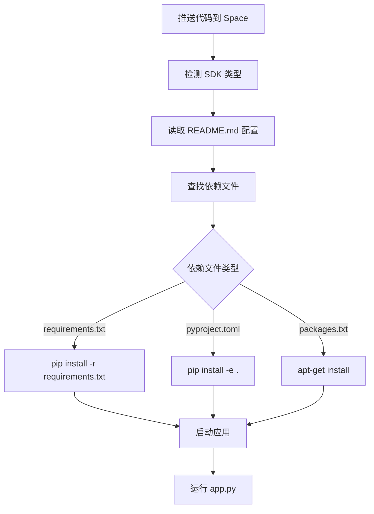

# Hugging Face Spaces 构建和环境安装详解

## 🏗️ 构建流程概览



## 📋 步骤详解

### 第 1 步：Space 配置检测

HF Spaces 读取 `README.md` 的 YAML 前置内容：

```yaml
---
title: Depth Anything 3
emoji: 🏢
colorFrom: indigo
colorTo: pink
sdk: gradio              # 🔑 关键：指定使用 Gradio SDK
sdk_version: 5.49.1      # Gradio 版本
app_file: app.py         # 🔑 关键：入口文件
pinned: false
license: cc-by-nc-4.0
---
```

### 第 2 步：依赖文件优先级

HF Spaces 按以下顺序查找依赖文件（找到第一个就使用）：

#### 1. `requirements.txt` ⭐ (最推荐)

```txt
torch>=2.0.0
gradio>=5.0.0
spaces
numpy<2
```

**安装命令：**
```bash
pip install -r requirements.txt
```

**优点：**
- ✅ 简单直接
- ✅ 构建速度快
- ✅ 兼容性最好
- ✅ 错误信息清晰

#### 2. `pyproject.toml` (你当前使用的)

```toml
[project]
dependencies = ["torch>=2", "numpy<2"]

[project.optional-dependencies]
app = ["gradio>=5", "spaces"]
```

**安装命令：**
```bash
pip install -e .
# 或者包含 optional dependencies
pip install -e ".[app]"
```

**问题：**
- ⚠️ 可能不会自动安装 `[project.optional-dependencies]`
- ⚠️ 需要正确的包结构（`src/` 目录等）
- ⚠️ 构建时间较长

#### 3. `packages.txt` (系统级依赖)

```txt
ffmpeg
libsm6
libxext6
```

**安装命令：**
```bash
apt-get update
apt-get install -y ffmpeg libsm6 libxext6
```

**用途：**
- 安装系统级库（非 Python 包）
- OpenCV 可能需要的系统库
- 音视频处理工具

### 第 3 步：实际构建过程

```bash
# === HF Spaces 内部执行的命令（简化版） ===

# 1. 准备环境
export HOME=/home/user
export PYTHONPATH=/home/user/app:$PYTHONPATH

# 2. 安装 Python 基础环境
python -m pip install --upgrade pip setuptools wheel

# 3. 安装系统依赖（如果有 packages.txt）
if [ -f packages.txt ]; then
    apt-get update
    xargs -a packages.txt apt-get install -y
fi

# 4. 安装 Python 依赖
if [ -f requirements.txt ]; then
    pip install -r requirements.txt
elif [ -f pyproject.toml ]; then
    pip install -e .
fi

# 5. 启动应用
python app.py
```

## 🔍 你的项目构建分析

### 当前问题：使用 pyproject.toml

你的 `pyproject.toml` 配置：

```toml
[project]
dependencies = [
    "torch>=2",
    "gradio",  # ❌ 这里没有 gradio！
    # ...
]

[project.optional-dependencies]
app = ["gradio>=5", "spaces"]  # ✅ gradio 在这里
```

**问题：**
- HF Spaces 可能只安装 `dependencies`，不安装 `optional-dependencies`
- 导致 `gradio` 和 `spaces` 可能不会被安装

### 解决方案 1：使用 requirements.txt (推荐) ✅

我已经为你创建了 `requirements.txt`，HF Spaces 会优先使用它：

```bash
# Spaces 会自动执行
pip install -r requirements.txt
```

### 解决方案 2：修改 pyproject.toml

将 gradio 移到主依赖：

```toml
[project]
dependencies = [
    "torch>=2",
    "gradio>=5",
    "spaces",
    # ... 其他依赖
]
```

### 解决方案 3：创建 .spacesrc

创建 `.spacesrc` 文件自定义构建：

```bash
pip install -e ".[app,gs]"
```

## 🚀 推荐配置

对于 HF Spaces 部署，推荐的文件结构：

```
depth-anything-3/
├── app.py              # 入口文件
├── requirements.txt    # Python 依赖（优先）
├── packages.txt        # 系统依赖（可选）
├── README.md          # Space 配置
├── src/
│   └── depth_anything_3/
│       └── ...
└── pyproject.toml     # 项目配置（备用）
```

## ⚡ 构建优化建议

### 1. 固定版本号

```txt
# ❌ 不推荐（构建不稳定）
torch>=2
gradio>=5

# ✅ 推荐（构建稳定）
torch==2.1.0
gradio==5.49.1
```

### 2. 预构建的 wheels

使用 PyPI 有预构建 wheel 的版本，避免从源码编译：

```txt
# ✅ 快速安装
torch==2.1.0
torchvision==0.16.0

# ⚠️ 慢（从源码编译）
gsplat @ git+https://github.com/...
```

### 3. 使用 Docker（高级）

创建自定义 Docker 镜像：

```dockerfile
FROM python:3.10
WORKDIR /app
COPY requirements.txt .
RUN pip install -r requirements.txt
COPY . .
CMD ["python", "app.py"]
```

## 🐛 常见问题

### Q1: 为什么构建失败？

**检查清单：**
1. ✅ 依赖文件是否存在？
2. ✅ 版本号是否兼容？
3. ✅ 是否需要系统依赖（packages.txt）？
4. ✅ 包名是否正确？

### Q2: 如何查看构建日志？

在 Space 页面：
1. 点击右上角 "Settings"
2. 滚动到 "Build logs"
3. 查看详细日志

### Q3: 构建时间太长怎么办？

**优化方法：**
1. 使用 `requirements.txt` 而不是 `pyproject.toml`
2. 移除不必要的依赖
3. 使用预构建的 wheels
4. 考虑使用 Docker 镜像缓存

### Q4: 本地能运行，Spaces 上失败？

**可能原因：**
1. 缺少系统依赖（需要 packages.txt）
2. 路径问题（本地是绝对路径）
3. 环境变量不同
4. Python 版本不同

**解决方法：**
```toml
# README.md 中指定 Python 版本
---
sdk: gradio
python_version: 3.10
---
```

## 📊 构建时间参考

| 依赖方式 | 平均构建时间 | 稳定性 |
|---------|------------|--------|
| requirements.txt | 2-5 分钟 | ⭐⭐⭐⭐⭐ |
| pyproject.toml | 5-10 分钟 | ⭐⭐⭐ |
| 从源码编译 | 10-30 分钟 | ⭐⭐ |

## 🎯 最佳实践

1. **使用 requirements.txt** 作为主要依赖管理
2. **固定关键依赖的版本号**
3. **测试本地环境** 使用 `pip install -r requirements.txt`
4. **监控构建日志** 及时发现问题
5. **逐步添加依赖** 一个一个测试，而不是一次性全加

## 🔗 相关资源

- [HF Spaces 文档](https://huggingface.co/docs/hub/spaces)
- [Gradio Spaces 指南](https://huggingface.co/docs/hub/spaces-sdks-gradio)
- [依赖管理](https://huggingface.co/docs/hub/spaces-dependencies)

